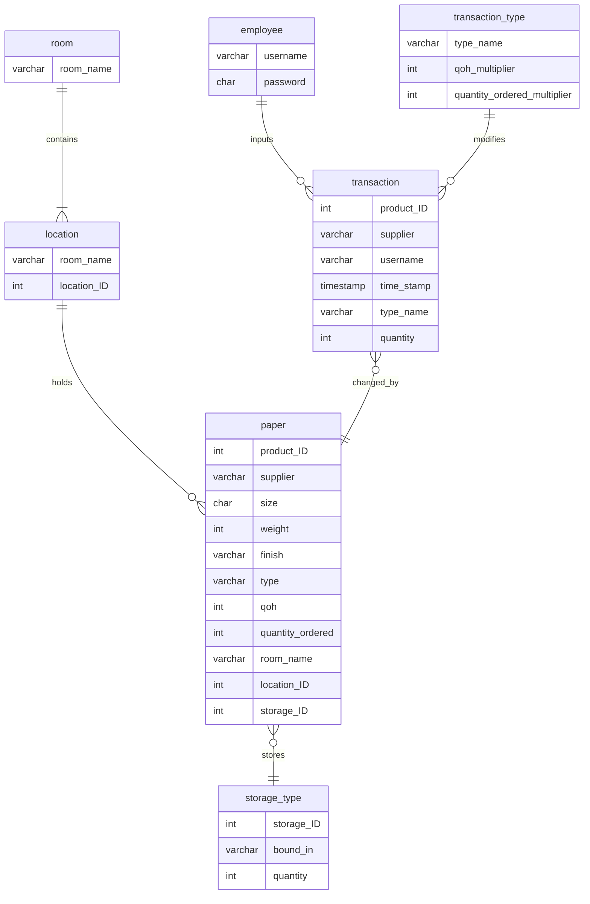

```mermaid
erDiagram
    room||--|{location : contains
    employee||--o{transaction : inputs
    location||--o{paper : holds
    paper}o--||storage_type : stores
    transaction}o--||paper : changed_by
    transaction_type||--o{transaction : modifies
    paper {
        int product_ID
        varchar supplier
        char size
        int weight
        varchar finish
        varchar type
        int qoh
        int quantity_ordered
        varchar room_name
        int location_ID
        int storage_ID
    }
    employee {
        varchar username
        char password
    }
    transaction {
        int product_ID
        varchar supplier
        varchar username
        timestamp time_stamp
        varchar type_name
        int quantity
    }
    location {
        varchar room_name
        int location_ID
    }
    room {
        varchar room_name
    }
    storage_type {
        int storage_ID
        varchar bound_in
        int quantity
    }
    transaction_type {
        varchar type_name
        int qoh_multiplier
        int quantity_ordered_multiplier
    }
```